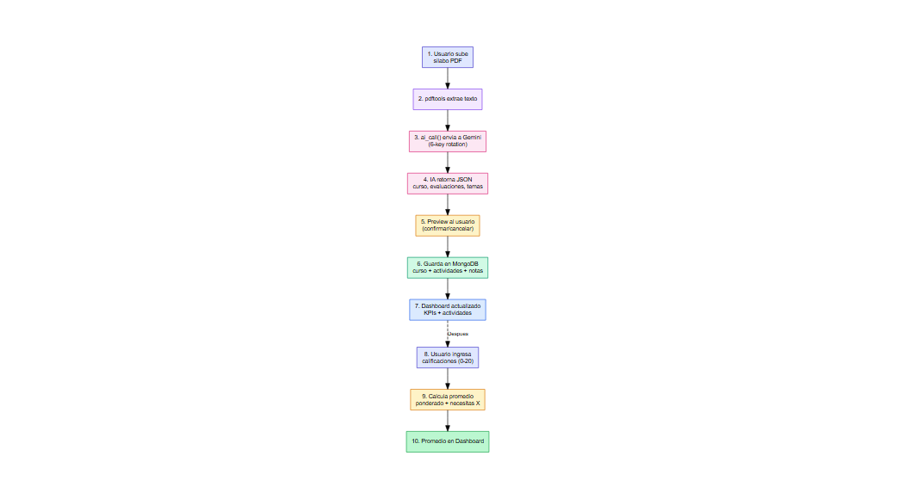
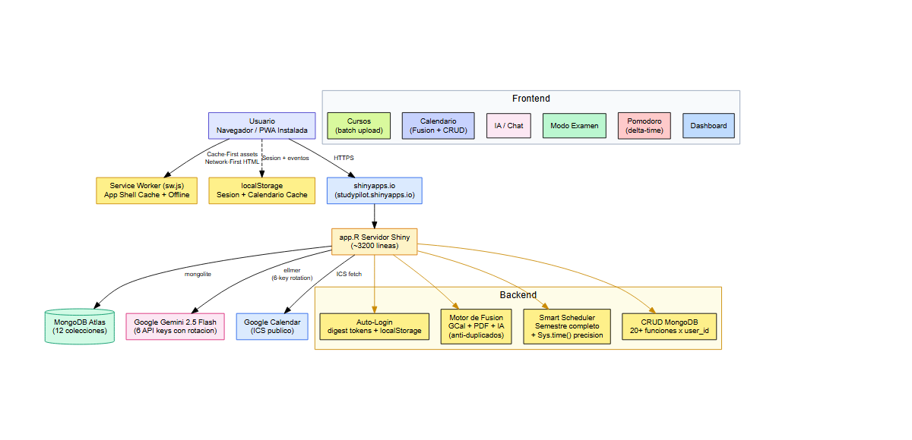

```{r setup, include=FALSE}
knitr::opts_chunk$set(echo = FALSE, warning = FALSE, message = FALSE)
library(knitr)
```

**Docente:** [Completar]

**Curso:** Principios de diseño de productos y servicios

**Integrantes:** Marvin Andy Calderón Flores — 100%

**Ciclo:** 2025-2

\newpage

# Introducción

En la actualidad, el cumplimiento de los objetivos académicos representa uno de los mayores desafíos para los estudiantes universitarios. La combinación de múltiples cursos, cada uno con evaluaciones de distinto peso distribuidas a lo largo de un ciclo de 16 semanas, genera una carga de gestión que compite directamente con el tiempo disponible para el estudio efectivo. A pesar de la intención de mantenerse organizados, la mayoría de los estudiantes recurre a herramientas fragmentadas —un PDF de horario, una agenda física, notas dispersas y cálculos manuales de promedios— que no ofrecen una visión unificada ni anticipan las evaluaciones críticas.

Como respuesta a esta problemática, el presente proyecto presenta **StudyPilot**, una plataforma web de estudio inteligente que centraliza la información académica del estudiante y automatiza las tareas de organización mediante inteligencia artificial. A diferencia de las agendas o gestores de tareas tradicionales, StudyPilot extrae automáticamente cursos, evaluaciones, pesos y temas desde los sílabos en PDF, fusiona el horario de clases con el calendario personal, calcula el rendimiento real por curso y genera un plan de estudio distribuido a lo largo del semestre.

El presente informe detalla el diseño, la propuesta de valor y el modelo de negocio de esta solución tecnológica. Se aborda desde la identificación de las necesidades del estudiante hasta la estructuración de un modelo sostenible, con el objetivo de demostrar cómo la integración de tecnología, ciencia del aprendizaje y automatización puede ofrecer un sistema de acompañamiento académico efectivo, accesible y escalable.

## Necesidad y Problemática

La problemática se define por la dificultad generalizada de los estudiantes universitarios para organizar y sostener un ritmo de estudio constante. La procrastinación académica es un fenómeno de alta prevalencia: diversos estudios estiman que entre el 80% y el 95% de los estudiantes universitarios procrastinan en alguna medida sus actividades académicas (Steel, 2007), conducta asociada a un menor rendimiento, mayor ansiedad y desorganización.

Esta situación se agrava por dos factores. Primero, la **dispersión de la información**: los sílabos, horarios, notas y fechas de evaluación viven en documentos separados, obligando al estudiante a realizar cálculos manuales para saber cuánto lleva acumulado o cuánto necesita para aprobar. Segundo, la tendencia a estudiar de forma concentrada la víspera del examen ("cramming" o práctica masiva), estrategia que la evidencia científica ha demostrado ineficiente para la retención a largo plazo. El meta-análisis de Cepeda, Pashler y colaboradores (2006), que agrupó 254 estudios y más de 14,000 participantes, concluyó de forma inequívoca que la práctica distribuida (espaciar el estudio en el tiempo) supera de manera consistente y sustancial a la práctica masiva.

En consecuencia, existe un vacío de herramientas que no solo organicen tareas, sino que combatan activamente la desorganización y promuevan hábitos de estudio respaldados por la ciencia del aprendizaje, adaptados además a la realidad universitaria peruana (escala vigesimal de 0 a 20 y estructura de sílabos institucional).

# Elaboración de Journey Map

El Journey Map de StudyPilot modela un día típico del estudiante universitario y los puntos de dolor donde la plataforma interviene. El recorrido inicia al despertar con la incertidumbre sobre las tareas del día, atraviesa las clases y los tiempos muertos entre ellas, y culmina en la noche con la sensación de no haber avanzado en lo importante. Los momentos de mayor frustración —planificar qué estudiar, descubrir una entrega olvidada, no saber cuánto se necesita para aprobar— constituyen las oportunidades de valor que StudyPilot resuelve mediante automatización y visibilidad.

*(Insertar aquí la Figura 1: Journey Map del estudiante — elaboración propia)*

## Objetivo

### Objetivo General

Desarrollar una plataforma web de estudio inteligente para estudiantes universitarios que centralice la información académica, automatice su ingreso mediante inteligencia artificial y promueva un ritmo de estudio distribuido, con el fin de reducir la desorganización y mejorar el cumplimiento de los objetivos académicos.

### Objetivos Específicos

- Automatizar la extracción de cursos, evaluaciones, pesos y temas desde sílabos en PDF mediante un modelo de lenguaje (Google Gemini), eliminando el ingreso manual de datos.
- Unificar en un solo calendario el horario de clases (PDF de matrícula), el calendario personal (Google Calendar) y los bloques de estudio generados automáticamente.
- Implementar un cálculo transparente del rendimiento por curso (puntos acumulados sobre 20 y nota necesaria por evaluación restante) sobre la escala vigesimal peruana.
- Distribuir el estudio a lo largo del semestre mediante un planificador inteligente que prioriza según cercanía y peso de las evaluaciones, aplicando el principio de práctica distribuida.
- Validar la plataforma con estudiantes reales para asegurar que la automatización y la visibilidad temporal incrementan la organización antes de un escalamiento mayor.

\newpage

# Modelo de Negocio (Canvas)

A continuación se desarrolla el modelo de negocio de StudyPilot según los nueve bloques del Business Model Canvas.

*(Insertar aquí la Figura 2: Canvas del modelo de negocio — elaboración propia)*

## Segmento de Clientes

El segmento principal está conformado por **estudiantes universitarios (18 a 30 años)** residentes en zonas urbanas con alto acceso a tecnología, matriculados en carreras con carga académica intensa y sistema de evaluación por pesos. Este perfil se caracteriza por tener la intención de mantener un buen rendimiento, pero que fracasa en la organización por depender de herramientas fragmentadas y de la memoria.

Se identifican dos sub-perfiles clave:

- **El Desorganizado**: pierde tiempo consolidando información dispersa (sílabos, horarios, notas) y ocasionalmente olvida entregas o evaluaciones por falta de una vista unificada.
- **El Estratega de Notas**: está altamente motivado por saber su promedio exacto en tiempo real y cuánto necesita en lo que resta para aprobar o alcanzar una meta; toma decisiones de esfuerzo según ese cálculo.

## Propuesta de Valor

StudyPilot ofrece una plataforma web de **organización académica automatizada e inteligente** que transforma documentos dispersos en un plan de estudio unificado y accionable. La propuesta se diferencia de las agendas y gestores de tareas tradicionales en que **elimina el trabajo manual de ingreso y cálculo** mediante inteligencia artificial, y en que **promueve activamente hábitos de estudio respaldados por la ciencia**.

Los pilares de la propuesta son:

1. **Automatización por IA**: la carga de un ciclo completo (6 o más cursos con sus evaluaciones y temas) pasa de horas de digitación manual a segundos, extrayendo la información directamente de los sílabos en PDF.
2. **Visibilidad total del rendimiento**: el estudiante ve en todo momento sus puntos acumulados sobre 20 por curso y la nota que necesita en cada evaluación restante para aprobar, sobre la escala vigesimal peruana.
3. **Práctica distribuida**: el Smart Scheduler reparte el estudio a lo largo del semestre en lugar de concentrarlo antes del examen. Esto se fundamenta en el efecto de espaciamiento, una de las estrategias de aprendizaje de mayor evidencia empírica (Dunlosky et al., 2013; efecto reportado por Hattie de 0.71).

## Canal de Distribución

La distribución se realiza principalmente a través de:

- Acceso web directo mediante enlace, sin necesidad de instalación (https://studypilot.shinyapps.io/plataforma/).
- Instalación como aplicación (PWA) en móvil y escritorio para acceso rápido desde la pantalla de inicio.
- Difusión en redes internas universitarias (chats de cursos y delegados) y códigos QR en el campus.

## Relación con los Clientes

La relación se centra en la confianza y la reducción de fricción. Al manejar datos académicos sensibles (notas, horarios), se prioriza un **enfoque de autoservicio asistido**: el usuario controla sus datos con autenticación propia y contraseñas cifradas, mientras que el asistente de IA integrado (chat) responde consultas específicas sobre sus propios cursos, notas y pendientes en lenguaje natural. Las notificaciones y el resumen "Esta Semana" mantienen al estudiante informado sin abrumarlo.

## Fuente de Ingresos

Se contempla un modelo **freemium** con tres niveles y una opcion institucional (B2B). El plan gratuito cubre la organizacion basica; los planes de pago desbloquean las funciones de inteligencia artificial (extraccion de silabos, examenes de practica, chat asistente y Smart Scheduler).

```{r precios}
precios <- data.frame(
  Plan = c("Free", "Premium Mensual", "Premium Semestral", "Institucional (B2B)"),
  Precio = c("S/. 0", "S/. 9.90 / mes", "S/. 39.90 / semestre", "S/. 3.00 / alumno-mes"),
  Incluye = c("2 cursos, calendario, Pomodoro",
              "Cursos ilimitados + IA + Google Calendar",
              "Todo Premium con 33% de descuento",
              "Todo Premium para instituciones"),
  stringsAsFactors = FALSE
)
kable(precios, caption = "Estructura de precios por plan")
```

El costo simbolico del plan Premium (por debajo del precio de un almuerzo universitario) funciona como filtro de compromiso (*Willingness to Pay*) y cubre el costo variable de la API de IA. El plan semestral incentiva la retencion a largo plazo, y el modelo B2B a S/. 3.00 por alumno es competitivo frente a plataformas educativas tradicionales.
## Recursos Clave

- **Tecnológicos**: la aplicación web (R Shiny), la API de inteligencia artificial (Google Gemini 2.5 Flash), la base de datos en la nube (MongoDB Atlas) y la infraestructura de despliegue (shinyapps.io).
- **Humanos**: desarrollo y mantenimiento, diseño de experiencia de usuario (UX/UI) y soporte.
- **Intangibles**: la lógica de negocio validada (cálculo vigesimal, motor de fusión de horarios, priorización), la confianza de marca y la adaptación al contexto universitario peruano.

## Actividades Clave

- **Desarrollo y mantenimiento** de la plataforma modular (arquitectura de 36 archivos: UI, servidor y funciones puras).
- **Optimización de prompts de IA** para asegurar extracciones precisas y controlar el costo de tokens.
- **Gestión de datos y privacidad**: aislamiento de la información por usuario y respaldo en la nube.
- **Mejora continua** a partir de indicadores de uso y retroalimentación de estudiantes.

## Alianzas Clave

- **Instituciones educativas** (universidades e institutos) para validación y difusión.
- **Proveedores de IA en la nube** (Google) para las funcionalidades inteligentes.
- **Billeteras digitales** (Yape, Plin) para viabilizar el micropago con baja fricción.

## Estructura de Costos

```{r costos}
costos <- data.frame(
  Concepto = c("Infraestructura (nube + despliegue)", "API de IA (variable por uso)",
               "Comisión de pasarela de pago", "Marketing y difusión"),
  Tipo = c("Fijo", "Variable", "Variable", "Fijo/Recurrente")
)
kable(costos, caption = "Estructura de costos de StudyPilot")
```

Los costos variables (IA y comisión de pago) solo se incurren cuando hay uso o ventas, lo que reduce el riesgo operativo: si el volumen baja, los gastos se ajustan automáticamente.

## Componentes Clave del Servicio

```{r componentes}
comp <- data.frame(
  Componente = c("Personas", "Procesos", "Evidencia Física"),
  Descripcion = c(
    "Estudiante universitario que busca organizarse; asistente de IA (chat) que responde sobre sus datos; soporte técnico.",
    "Ciclo del servicio: registro con auto-login persistente, carga de silabo PDF, extraccion por IA, fusion de horario, seguimiento de notas y generacion del plan de estudio.",
    "Interfaz web responsiva instalable como PWA; funciona offline mostrando la ultima informacion cacheada; notificaciones y resumen semanal."
  )
)
kable(comp, caption = "Componentes clave del servicio (App Web)")
```

\newpage
# Desarrollo de la Propuesta de Valor

## Aplicativo Web

StudyPilot es una aplicación web funcional y desplegada, accesible desde cualquier navegador e instalable como PWA.

- **Enlace de la aplicación:** https://studypilot.shinyapps.io/plataforma/
- **Repositorio del código:** https://github.com/Mcfcalderon/StudyPilot

```{r fig-flujo, fig.cap="Figura 3. Flujo de extraccion por IA: del silabo PDF al plan de estudio", out.width="55%", fig.align="center"}

```

La plataforma se organiza en módulos accesibles desde una barra de navegación: Inicio (dashboard), Estudio (Pomodoro), Exámenes, Actividades, Notas, Calendario, Cursos y Analytics.

### Funcionalidades principales

```{r funcionalidades}
fun <- data.frame(
  Modulo = c("Cursos", "Calendario", "Smart Scheduler", "Notas", "Analytics",
             "Exámenes IA", "Chat asistente", "Pomodoro", "Inicio"),
  Descripcion = c(
    "Extraccion automatica de curso, evaluaciones, pesos y temas desde silabos PDF por IA (carga en lote de varios silabos).",
    "Fusion del horario de clases (PDF), Google Calendar y bloques de estudio IA, con edicion por arrastre y linea de hora actual.",
    "Generacion de bloques de estudio distribuidos en el semestre, priorizando por cercania y peso de la evaluacion.",
    "Registro de calificaciones sobre escala 0-20; muestra puntos acumulados y nota necesaria por evaluacion restante para aprobar.",
    "Estado de preparacion por examen y alerta de deuda academica (temas vinculados vs bloques de estudio completados).",
    "Generacion de examenes de practica basados en los temas del curso, aplicando el efecto de evaluacion (testing effect).",
    "Asistente que responde preguntas especificas sobre los cursos, notas y pendientes reales del propio estudiante.",
    "Temporizador de estudio con persistencia de sesiones en la base de datos.",
    "Resumen compacto del dia: proximas entregas, promedio y alertas."
  )
)
kable(fun, caption = "Funcionalidades principales de StudyPilot")
```

## Diferencial del Producto

El diferencial de StudyPilot frente a agendas, hojas de cálculo y gestores de tareas genéricos se resume en tres ejes:

1. **Cero ingreso manual**: mientras otras herramientas exigen digitar cada curso y evaluación, StudyPilot lee el sílabo PDF y lo estructura automáticamente con IA.
2. **Cálculo académico real y local**: adaptado a la escala vigesimal (0-20) y a la lógica de pesos por evaluación, mostrando puntos asegurados y la nota exacta necesaria para aprobar —algo que las apps internacionales no contemplan.
3. **Estudio basado en evidencia**: el Smart Scheduler operacionaliza la práctica distribuida y los exámenes de práctica aplican el efecto de evaluación, dos de las estrategias de aprendizaje con mayor respaldo científico (Dunlosky et al., 2013).

## Análisis Comparativo

La siguiente tabla compara a StudyPilot con las principales alternativas del mercado. El diferencial se concentra en la extraccion por IA, la fusion de horarios y la adaptacion a la escala peruana 0-20, ausentes en los competidores.

```{r comparativa}
comp <- data.frame(
  Caracteristica = c("Precio", "Extraccion IA de silabos", "Horario desde PDF",
                     "Fusion GCal + PDF + IA", "Smart Scheduler semestral",
                     "Simulador de promedios 0-20", "Examenes de practica IA",
                     "PWA offline-first", "Adaptado a Peru"),
  MyStudyLife = c("Gratis","No","No","No","No","No","No","No","No"),
  Notion = c("Freemium","No","No","No","No","No","No","No","No"),
  PowerPlanner = c("$1.99","No","No","No","No","Si (GPA)","No","No","No"),
  StudyPilot = c("Freemium","Si","Si","Si","Si","Si","Si","Si","Si"),
  stringsAsFactors = FALSE
)
kable(comp, caption = "StudyPilot frente a competidores principales")
```

## Viabilidad Financiera

La estructura de costos de StudyPilot es de bajo riesgo: los costos variables (API de IA y comision de pasarela) solo se incurren con el uso o las ventas. La proyeccion del primer año contempla dos escenarios:

```{r viabilidad}
fin <- data.frame(
  Concepto = c("Usuarios registrados", "Activos mensuales", "Conversion a Premium",
               "Ingreso total (año 1)", "Costos operativos", "Utilidad neta"),
  Conservador = c("500", "200 (40%)", "5% (~10)", "S/. 1,188", "S/. 624", "S/. 564"),
  Optimista = c("2,000", "800 (40%)", "8% (~64)", "S/. 6,668", "S/. 1,800", "S/. 4,868"),
  stringsAsFactors = FALSE
)
kable(fin, caption = "Proyeccion financiera del primer año (dos escenarios)")
```

En ambos escenarios el proyecto es rentable desde el primer año, gracias al costo operativo bajo (infraestructura en niveles gratuitos durante la etapa inicial) y al modelo de ingresos recurrente.

# Conclusiones

**Solución integral y funcional.** StudyPilot integra con éxito tres pilares —automatización por inteligencia artificial, ciencia del aprendizaje (práctica distribuida y efecto de evaluación) y adaptación al contexto universitario peruano— en una plataforma web funcional, desplegada y de acceso público, no en un simple prototipo.

**Reducción efectiva de la fricción.** Al eliminar el ingreso manual de datos mediante la extracción por IA desde sílabos PDF, la plataforma reduce de horas a segundos la tarea que más desincentiva el uso de herramientas de organización, atacando directamente la raíz de la desorganización académica.

**Transparencia en el rendimiento.** El cálculo de puntos acumulados sobre 20 y de la nota necesaria por evaluación restante entrega al estudiante una visibilidad de la que carecen las herramientas genéricas, permitiéndole tomar decisiones informadas de esfuerzo sobre la escala vigesimal real.

**Modelo sostenible y de bajo riesgo.** El esquema freemium con micropago y costos variables (IA y pasarela) que solo se incurren con el uso protege la operación frente a fluctuaciones de demanda, mientras que la arquitectura modular facilita el mantenimiento y la escalabilidad.

# Observaciones

**Sensibilidad al costo de la IA.** El consumo de la API de inteligencia artificial es el principal costo variable. Un uso intensivo del chat o de la generación de exámenes por encima del promedio podría reducir márgenes; se recomienda monitorear el ratio de tokens por usuario y optimizar los prompts del sistema.

**Dependencia de la calidad del PDF.** La extracción automática asume sílabos con texto legible. Documentos escaneados como imagen o con formatos muy irregulares pueden requerir corrección manual; una mejora futura sería incorporar OCR.

**Privacidad de datos académicos.** Al almacenar notas y horarios, es crítico mantener el aislamiento de datos por usuario y las contraseñas cifradas. Cualquier escalamiento debe reforzar el cumplimiento de normativa de protección de datos personales.

**Umbral de aprobación configurable.** El cálculo de "nota necesaria para aprobar" usa un umbral que debe alinearse con el reglamento de cada institución (por ejemplo, 10.5 o 13). Se recomienda hacerlo configurable por el usuario.

\newpage
# Referencias Bibliográficas

Cepeda, N. J., Pashler, H., Vul, E., Wixted, J. T., & Rohrer, D. (2006). Distributed practice in verbal recall tasks: A review and quantitative synthesis. *Psychological Bulletin, 132*(3), 354–380. https://doi.org/10.1037/0033-2909.132.3.354

Cirillo, F. (2006). *The Pomodoro Technique*. FC Garage.

Dunlosky, J., Rawson, K. A., Marsh, E. J., Nathan, M. J., & Willingham, D. T. (2013). Improving students learning with effective learning techniques: Promising directions from cognitive and educational psychology. *Psychological Science in the Public Interest, 14*(1), 4–58. https://doi.org/10.1177/1529100612453266

Hattie, J. (2009). *Visible learning: A synthesis of over 800 meta-analyses relating to achievement*. Routledge.

Steel, P. (2007). The nature of procrastination: A meta-analytic and theoretical review of quintessential self-regulatory failure. *Psychological Bulletin, 133*(1), 65–94. https://doi.org/10.1037/0033-2909.133.1.65

\newpage

# Anexos

## Anexo A. Arquitectura y stack tecnológico

```{r stack}
stack <- data.frame(
  Capa = c("Frontend / UI", "Backend / Servidor", "Base de datos",
           "Inteligencia Artificial", "Autenticacion", "Despliegue", "PWA"),
  Tecnologia = c(
    "R Shiny + bslib (Bootstrap 5), DT, CSS personalizado",
    "R (logica reactiva modular con source local=TRUE)",
    "MongoDB Atlas (mongolite)",
    "Google Gemini 2.5 Flash (via ellmer)",
    "sodium (hash scrypt) + digest",
    "shinyapps.io (rsconnect)",
    "Service Worker + localStorage (offline-first, instalable)"
  )
)
kable(stack, caption = "Stack tecnologico de StudyPilot")
```

## Anexo B. Arquitectura modular

```{r fig-arq, fig.cap="Figura 4. Arquitectura del sistema: frontend, backend y servicios", out.width="100%", fig.align="center"}

```


El proyecto sigue una arquitectura modular de 36 archivos que separa presentación, lógica reactiva y funciones puras:

- **app.R** — punto de entrada; carga variables de entorno, reactivos compartidos y monta UI/servidor.
- **global.R** — librerías, carga dinámica de R/ y ui/, constantes del semestre.
- **ui/** (11 módulos) — interfaz: login, navbar, dashboard, pomodoro, calendario, cursos, notas, examen, actividades, chat, analytics.
- **server/** (12 módulos) — lógica reactiva por dominio, cargada con `source(local = TRUE)`.
- **R/** (5 librerías) — funciones puras: ai_functions, db_mongo, exam_bank, google_cal, study_guides.
- **www/** — CSS, JavaScript (Pomodoro delta-time, Service Worker), manifiesto PWA.

## Anexo C. Esquema de datos (MongoDB)

```{r schema}
schema <- data.frame(
  Coleccion = c("users", "custom_courses", "activities", "grades",
                "schedules", "ai_blocks", "pomo_sessions", "syllabi"),
  Contenido = c(
    "Credenciales (hash), nombre",
    "Cursos del usuario: id, nombre, creditos, profesor, formula",
    "Evaluaciones/tareas: curso, tipo, nombre, fecha, peso, is_calificada",
    "Notas por evaluacion: curso, codigo, nota (0-20)",
    "Horario de clases extraido del PDF: dia, hora, curso, aula",
    "Bloques de estudio generados por IA",
    "Sesiones Pomodoro completadas",
    "Texto de silabos subidos"
  )
)
kable(schema, caption = "Colecciones de la base de datos")
```

## Anexo D. Métricas del proyecto

```{r metricas}
met <- data.frame(
  Metrica = c("Arquitectura", "Modulos UI", "Modulos servidor",
              "Librerias R/", "Tiempo de arranque", "Estado"),
  Valor = c("36 archivos modulares", "11", "12", "5",
            "~0.4 s", "Desplegado y funcional en produccion")
)
kable(met, caption = "Metricas del proyecto")
```
